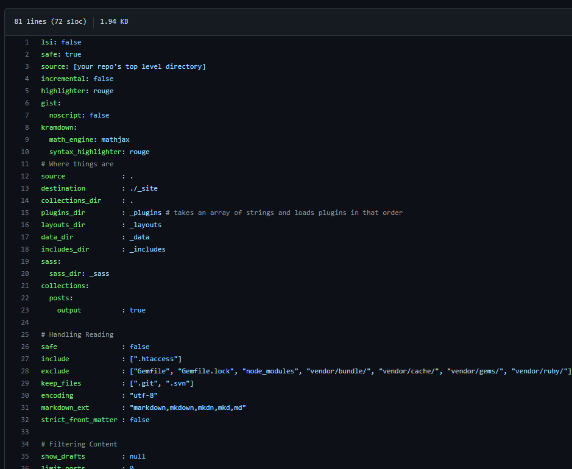

# Develop My Resume using markdown and host it on GitHub

##### Build a well-formatted resume using markdown and hosting it online. Stop wasting time and money on printing out the resume! To make our life easier, develop a resume with Andrew Etter's book Modern Technical Writing's principle and host it on GitHub.

## Table of Contents:
- [Few tools we need and ....._it's free_](#tools-needed-for-hosting-on-github)
- [Formatting Resume with Markdown](#formatting-resume-with-markdown)
- [Hosting a website](#hosting-a-resume-on-github)
- [Resources](#resources)
- [Authors and Acknowledge](#authors)
- [FAQs](#faqs)

### Tools needed for hosting on GitHub:
##### 1. [GitHub](https://github.com/):
   > A platform that provide hosting and version control features. For me, GitHub is just a free server that I can store my files and folders on it, it is similar to google cloud but with more features. One of the features that I liked and will want to share to you later is the hosting website using GitHub.
##### 2. [Visual Studio Code](https://code.visualstudio.com/):
   > A software/editor that allow people to coding/programming their project. I often uses vscode to programming my project, since vscode has a very range of language extension that allow me to programming different language on one editor such as .markdown, .javascript, .html, and etc. Also, people can access their files and folders on Github using vscode, which makes people life more easy.
##### 3. [GitHub pages](https://pages.github.com/):
   > A website that provide very detail information about how to use host a website using GitHub.
##### 4. [Jekyll](https://jekyllrb.com/)(Optional):
   > A website that provided a lot of template that free for everyone to use to aply to their resume or website. They also help people to host a static/local website, so that people like me who hate waiting can look at the effect on the static website immediately after I changed something to my website.

### Formatting Resume with Markdown
#### Step 1: Installation of VScode
   >- [Here is the installation of VScode.](https://code.visualstudio.com/learn/get-started/basics) This is the official website of VScode and it contains very helpful information about how to install and setup VScode into Computer.

#### Step 2: Start writing Resume using Markdown language
   >- Now create a new file in VScode by select the **File** > **New File** at the top-left corner.

   

   >- Continue by naming the file with this formant

   

   >- And now start writing with markdown language. [Here have some tutorial about how to write in markdown.](#resources)
   
### Hosting a resume on GitHub
#### Step 1: Create a repository on GitHub
   >- Visit to [GitHub website](https://github.com/) and login to my account(create an account if do not have one). 
   >- Click on the plus sign button on the top right corner which beisde to my profile picture, and select the **New repository** from the dropdown menu. 
   
   

   >- Create the repository with this format.
   
   

   >- Finally, set the repository to public and hit the **Create Repository** button.

#### Step 2: Adding my resume to the repository
   >- Go to the repository that just created.
   >- By searching the repository name on the top-left corner.

   

   >- Now, adding my resume to the repository by clicking the **Add file** button and select the upload file([might need to create a new file if do not have a resume yet](#formatting-resume-with-markdown))
   
   
   
   >- Once the resume is up, time to host it on Github.

#### Step 3: Using Jekyll to host my resume
   >- First, create a new file in repository and name it **_config.yml**. The step is similar as step 2 but choosing the **Create new file** from the dropdown.

   

   >- Inside the new file, passing Jekyll code in it from [here.](https://jekyllrb.com/docs/configuration/default/) _Remember copy all the code._

   

   >- After copying all the code, commit the changes.

   

   >- Finally, let view the resume online by typing the repository name with **/resumeFileName.html** on the browser and hit Enter.

   

## Resources
- [Modern Technical Writing: An Introduction to Software Documentation](https://www.amazon.ca/Modern-Technical-Writing-Introduction-Documentation-ebook/dp/B01A2QL9SS)
- [Markdown Tutorial](https://www.markdowntutorial.com/)
- [Markdown cheat sheet](https://www.markdownguide.org/basic-syntax/)
- [GitHub pages](https://pages.github.com/)
- [Jekll](https://jekyllrb.com/)
- [Visual Studio Code](https://code.visualstudio.com/)
- [Markdown in Visual Studio Code](https://code.visualstudio.com/docs/languages/markdown)
- [Markdown to GitHub Pages](https://nicolas-van.github.io/easy-markdown-to-github-pages/)

## Authors
- [Jacksonkao](https://github.com/Jacksonkao97)
- [Meenal Bhatia]()
- [Maxim Omelchenko]()
- [Tirenioluwa Biodun-Kuti]()
- [James Grant](https://github.com/sproogen)
- [Billie Thompson](https://github.com/PurpleBooth)

## Acknowledgements
- [Awesome README](https://github.com/matiassingers/awesome-readme)
- [Good README Template](https://github.com/PurpleBooth/a-good-readme-template)
- [Resume template](https://github.com/sproogen/modern-resume-theme)

## FAQs
#### 1. Why is Markdown better than a word processor?
   - Formatting by code.
   - No complicate features.
   - Easy to use.
   - Easy to convert to other file type.
   - Do not have fancy stuff.
#### 2. Why is my resume not showing up?
   - Make sure the Github server is not down.
   - Make sure put the resume in the right path.
   - Check the setting in the repository that uses to hosting the resume, make sure the hosting branch is the correct branch.